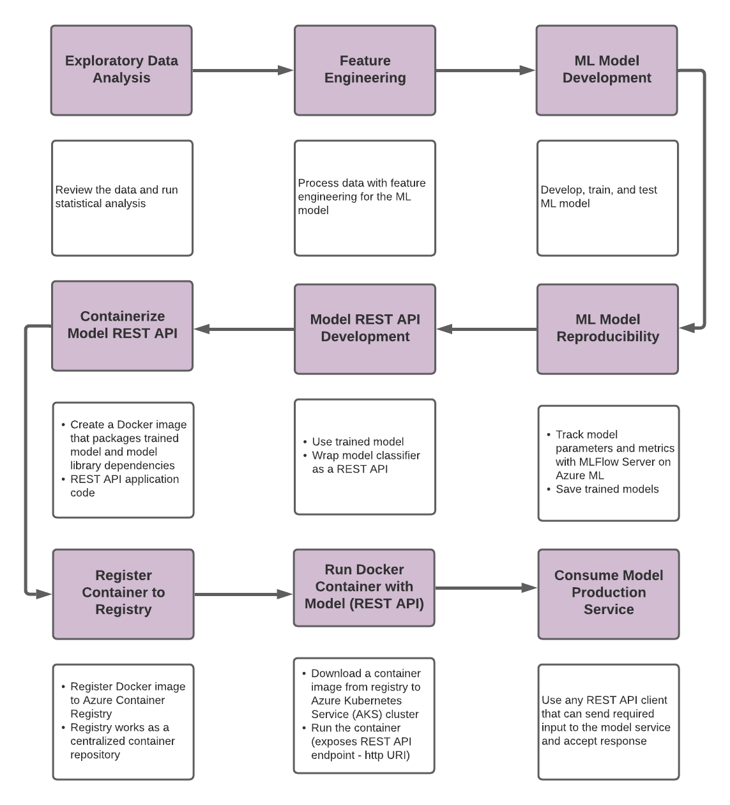

# <b>Breast Cancer Detection Classification with a Machine Learning Model Deployed as a Web Service</b>

## <b>Description</b>

 

A classification model was developed to review a breast cancer data set (Dua & Graff, 2019). The model
was trained and tested to produce an accuracy 97.1%. The experiments and runs were captured on
MLFlow Server in Azure ML to ensure reproducibility. The model was wrapped as REST API which at
the end of the development would make the classifier model accessible to any user. In order to
accomplish this task, the following steps were taken as illustrated with the Figure 1:

 

Figure 1: Flow Chart of Classification Model Development

 

## <b>Getting Started</b>

 

### <b>Dependencies</b>

 

- Pandas
- Numpy
- Matplotlib
- Seaborn
- Warnings
- Sklearn
- Mlflow
- Os
- Workspace (Azureml)
- Json
- Copyfile
- Flask
- Request
- Swagger
- Pickle

 

### <b>Installing</b>

 

- Docker Desktop
- Kubernetes CLI

 

### <b>Development</b>

 

1. Develop classification model with Jupyter Notebook
    - Exploratory Data Analysis
    - Feature Engineering
    - Build, train, and test ML classification model
    - Track the Experiment and Runs on MLFlow Server on Azure ML
    - Download the model from Azure ML

2. Develop FlaskAPI,py file with Flasgger for the input data to retrieve predicted
classification

3. Start Anaconda Prompt.
    - conda activate [select appropriate environment]
    - pip install flask (in case dependency is not installed)
    - pip install swagger (in case dependency is not installed)
    - python FlaskAPI.py

4. Start web browser
    - Navigate to address: http://127.0.0.1:5000/apidocs
    - Click on POST
    - Click on Try it out
    - Click on Browse
    - Select input data file to upload or enter input data
    - Open Developer Tools
    - Click Execute
    - Within the Web Developer Tools, under Network Monitor, in File, click name of instance to view the Response results

5. Anaconda prompt

    View the model’s predicted classification indicated by “Debug: Prediction: <insert predicted value>”

6. Create Docker image
   - Create Dockerfile
   - Create requirements.txt
   - Build the Docker image
   - Ran the Docker image to test
   - Repeat Step 4

7. Register Docker image to Azure Container Registry
   - Create Container Registry on Azure PaaS
   - Sent the Docker image to the Container Registry

8. Configure the Kubernetes cluster
   - Create YAML file
   - Assign name of the deployment to the appropriate assignments
   - Assign name of the Container Registry to the “containers: image: <name of Container Registry>.azurecr.io/<name of the deployment>" of YAML file
   - Assign port, if other different than 5000
   - Capture assigned External IP Address

9. Test the deployed classification model
   - Copy the link: http://52.154.62.204:5010/apidocs
   - Open browser
   - Repeat Step 4

 

### <b>Expected Results</b>

 

The classification model processed the input data and successfully provided the classification
prediction for each input with values of M for Malignant or B for Benign.

 

### <b>Issue</b>

 

1. The initial intention was to develop the entire the project on an Azure Virtual Machine, but
had many challenges to install the Python dependency, Pickle5, on it. After several
attempts and numerous reviews of discussion boards, the process was moved to the local
computer.
2. Free Azure account has limited services available which required upgrading the
subscription.
3. Issue accessing the ML Server on Azure ML required identifying a Tenant ID.

 

### <b>Source Control</b>

 

The group collaborated by each building their own model and deployment and assisted each
other on any open issues. Each member provided their submission in their assigned branch.
Narges Bassirzadeh provided her submission in a fork.

Group Submission: https://github.com/amcclead7336/Enterprise_Data_Science_Final.git

Bassirzadeh Submission: https://github.com/NargesBassir/Enterprise_Data_Science_Final.git

 

### <b>Authors</b>

 

- Narges Bassirzadeh
- Alexander McClead
- Cesar Martinez

 

### <b>Version History</b>

 

- 0.1 - Initial Release

 

### <b>License</b>

 

The MIT License (MIT)

Copyright (c) 2021

Permission is hereby granted, free of charge, to any person obtaining a copy of this software and
associated documentation files (the "Software"), to deal in the Software without restriction,
including without limitation the rights to use, copy, modify, merge, publish, distribute,
sublicense, and/or sell copies of the Software, and to permit persons to whom the Software is
furnished to do so, subject to the following conditions:

The above copyright notice and this permission notice shall be included in all copies or
substantial portions of the Software.

THE SOFTWARE IS PROVIDED "AS IS", WITHOUT WARRANTY OF ANY KIND,
EXPRESS OR IMPLIED, INCLUDING BUT NOT LIMITED TO THE WARRANTIES OF
MERCHANTABILITY, FITNESS FOR A PARTICULAR PURPOSE AND NONINFRINGEMENT. 
IN NO EVENT SHALL THE AUTHORS OR COPYRIGHT HOLDERS BE LIABLE FOR ANY 
CLAIM, DAMAGES OR OTHER LIABILITY, WHETHER IN AN ACTION OF CONTRACT, 
TORT OR OTHERWISE, ARISING FROM, OUT OF OR IN CONNECTION WITH THE 
SOFTWARE OR THE USE OR OTHER DEALINGS IN THE SOFTWARE.

 

### <b>References</b>

 

Dua, D., & Graff, C. (2019). Breast Cancer Wisconsin (Diagnostic) Data Set. Retrieved from
    UCI Machine Learning Repository: https://archive.ics.uci.edu/ml/datasets/Breast+Cancer+Wisconsin+%28Diagnostic%29

 
